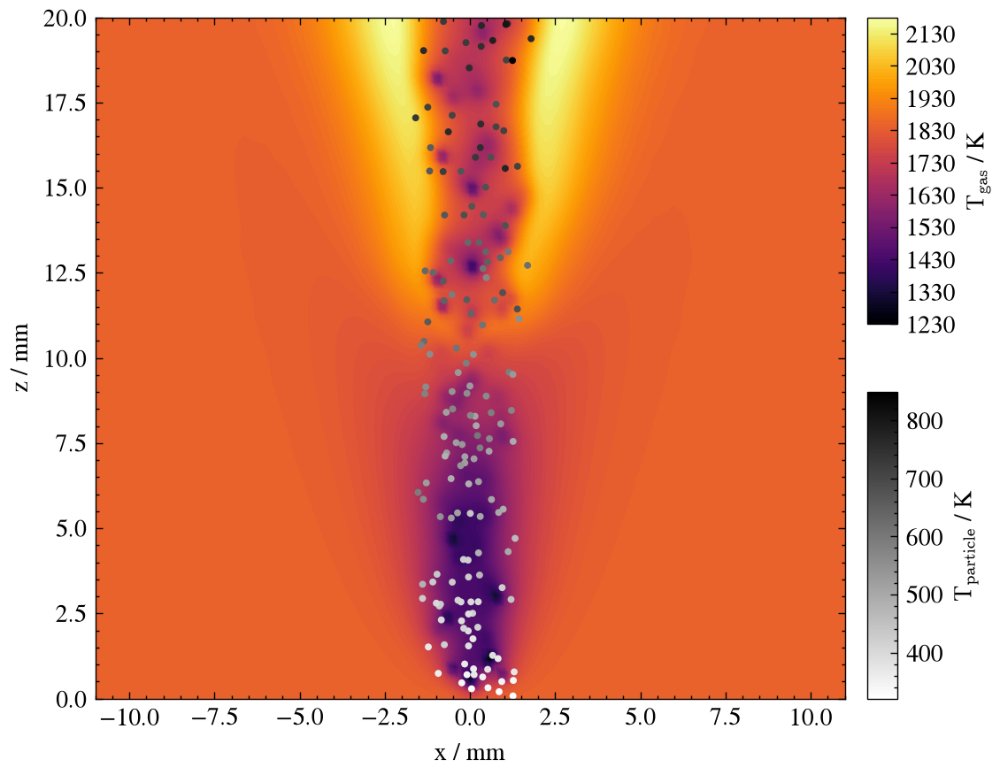
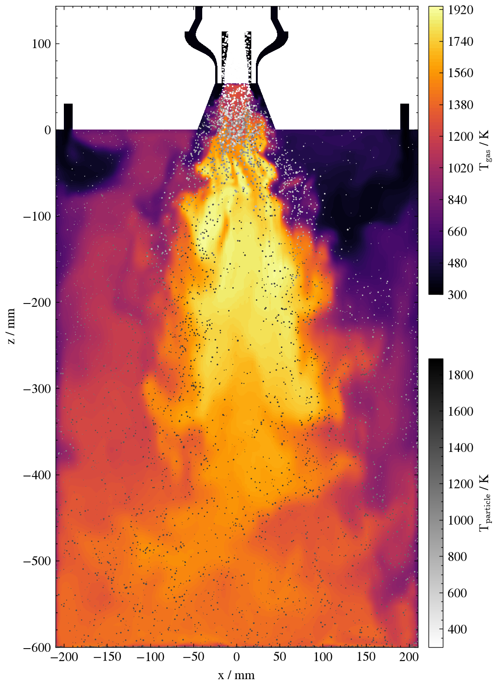

# oxysim-demo-cases

[](https://doi.org/10.5281/zenodo.23218637)

Runnable demonstration cases for
[oxysim-129](https://github.com/STFS-TUDa/oxysim-129),
an OpenFOAM-based flamelet/FLUT combustion framework with Lagrangian
particle coupling. Each case here is a real, working configuration of
`flameletCloudFoam` -- not a synthetic tutorial.

## Prerequisites

- oxysim-129 with its dependencies (OpenFOAM, Cantera, Sundials), built and
  set up as described in its
  [README](https://github.com/STFS-TUDa/oxysim-129#installation), including
  `scripts/source_local.sh`. This provides `flameletCloudFoam`.
- [Git LFS](https://git-lfs.github.com/) -- `laminar-coal`'s flamelet table
  and `turbulent-oxyfuel-biomass`'s mesh are large binary data tracked
  outside plain Git.

## Quickstart

```bash
git clone https://github.com/STFS-TUDa/oxysim-demo-cases.git
cd oxysim-demo-cases
git lfs install
git lfs pull
```

Then follow the "How to run it" section in whichever case's README you
want to use.

## Cases

<table>
  <tr>
    <td align="center" valign="middle">
      <br>
      <sub><b>laminar-coal</b>, t = 0.15 s</sub>
    </td>
    <td align="center" valign="middle">
      <br>
      <sub><b>turbulent-oxyfuel-biomass</b>, t = 7.07 s</sub>
    </td>
  </tr>
</table>

Gas temperature on the y = 0 plane with the particle cloud coloured by
particle temperature (white = cold, black = hot; dot area scales with
particle diameter in the turbulent case). Both are the last available
time step of the corresponding production run, not the time step shipped
in this repo. Regenerate them with
[`visualization/images/make_readme_images.py`](visualization/images/make_readme_images.py).

| | [`laminar-coal/`](laminar-coal/) | [`turbulent-oxyfuel-biomass/`](turbulent-oxyfuel-biomass/) |
|---|---|---|
| Flow | Laminar | Turbulent, LES (`sigma` subgrid model) |
| Fuel / FLUT | Single-fuel, non-premixed (`Z`, `ha`, `yc`) | Multi-fuel (`Z`, `Y`, `YY`, `ha`, `yc`), plus a variance-normalized `Zvar` dimension |
| Particles | Coal cloud, devolatilization only | Walnut-shell cloud, devolatilization + char oxidation |
| Radiation | None | `fvDOMwsgg` + binary WSGG absorption/emission, coupled to the particle cloud |
| Mesh | Regenerated by `blockMesh` (scripted in `Allrun`) | Static, no meshing pipeline -- shipped via Git LFS |
| Starting point | True `t=0`, hand-authored initial conditions | Earliest available checkpoint of an ongoing production run (this case has never had a true `t=0`) |
| Repo size | ~1GB (incl. ~900MB FLUT table) | ~530MB (its ~29GB combined FLUTs are hosted on TUdatalib, see below) |

`laminar-coal` is the simplest possible `flameletCloudFoam` configuration
and the better starting point if you're new to the framework.
`turbulent-oxyfuel-biomass` exercises most of what oxysim-129 can do at
once: multi-fuel chemistry, a variance-normalized FLUT dimension,
two-stage particle conversion, and radiative particle-gas coupling.

## Visualization

[`visualization/`](visualization/) holds Jupyter notebooks (and a
virtual-environment setup script) for plotting both cases' results; see its
[README](visualization/README.md).

## Flamelet tables

The flamelet tables of `turbulent-oxyfuel-biomass` (`FLUT.h5` ~18GB,
`FLUT_BC.h5` ~11GB) are too large for GitHub and are therefore available
from [TUdatalib](https://tudatalib.ulb.tu-darmstadt.de/handle/tudatalib/5606);
see that case's README for where to place them.

## How to cite

When using one of these cases, cite both:

1. **This repository's DOI** (the demo cases themselves) --
   [doi:10.5281/zenodo.23218637](https://doi.org/10.5281/zenodo.23218637).
2. **The paper the case is based on:**
   - `laminar-coal`: Nicolai et al. (2021),
     [doi:10.1016/j.proci.2020.06.081](https://doi.org/10.1016/j.proci.2020.06.081)
   - `turbulent-oxyfuel-biomass`: Vahl et al. (2026),
     [doi:10.1016/j.fuel.2026.138602](https://doi.org/10.1016/j.fuel.2026.138602)

The full references are in the "Reference" section of each case's README
([`laminar-coal`](laminar-coal/README.md#reference),
[`turbulent-oxyfuel-biomass`](turbulent-oxyfuel-biomass/README.md#reference)).

## License

Released under the [GNU General Public License v3.0](LICENSE), the same license
as [oxysim-129](https://github.com/STFS-TUDa/oxysim-129).
